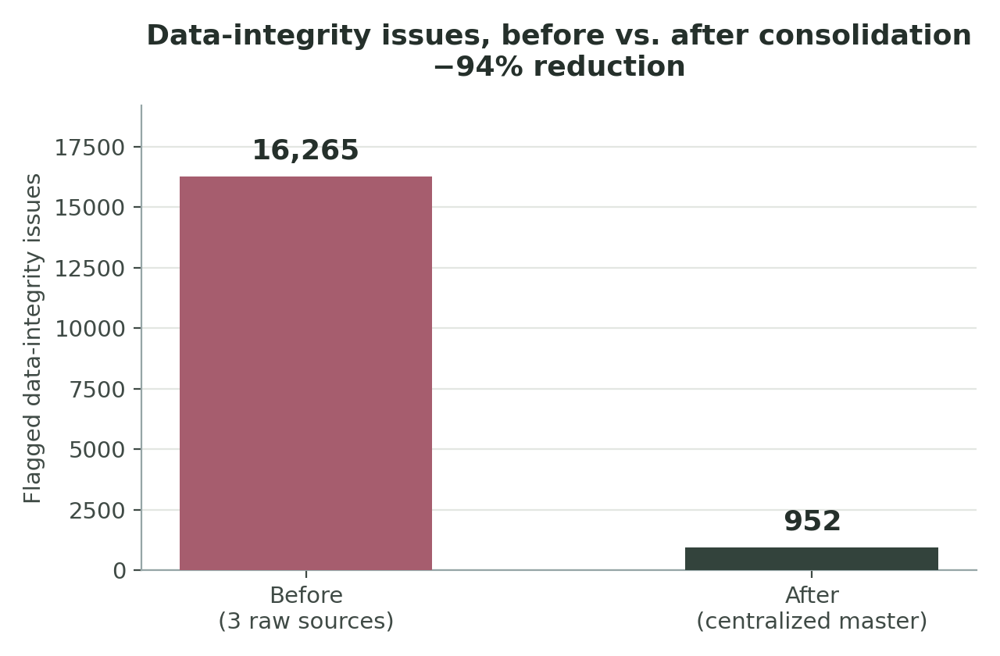

# Amal's Boutique — Product Catalog Data Integrity & Consolidation

**Goal:** Amal's Boutique's product data lived in three disconnected systems that had
drifted apart over time — an in-store point-of-sale export, four suppliers'
catalog spreadsheets, and the e-commerce platform's product export. This
project queries and profiles all three, quantifies exactly where they
disagree or break basic data-quality rules, and consolidates them into one
centralized master catalog.

## Data

| Source | Format | Rows |
|---|---|---:|
| `legacy_pos_export.csv` | in-store POS system export | 7,588 |
| `supplier_catalog_feed.csv` | 4 suppliers' vendor spreadsheets | 6,843 |
| `ecommerce_platform_export.json` | online storefront product export | 7,449 |
| **Total raw records queried & analyzed** | | **21,880** |

*(Synthetic data, generated with `generate_sources.py` to realistically
reproduce the kinds of drift three independent retail systems accumulate —
inconsistent category labels, stale/foreign-currency prices, async stock
counts, duplicate re-entries, orphaned supplier references. Seeded/
deterministic, so the whole pipeline is reproducible end to end.)*

## Method

**1. SQL — profile the raw sources** (`integrity_audit.sql`, executed via
`sqlite3`/Python in `consolidate.py`). Each raw source is loaded into SQLite
as-is and queried to count concrete integrity gaps: missing or unrecognized
supplier references, category labels outside the 6 canonical categories,
prices stored as formatted text or in the wrong currency, negative/invalid
stock counts, and exact duplicate row entries.

**2. Python — normalize, match & centralize** (`consolidate.py`). Each
source uses a different key scheme and formatting convention for the same
underlying products, so there's no shared ID to join on. The pipeline:
- normalizes product names (strips size/variant suffixes, punctuation, case)
- maps every category-label variant back to one of the 6 canonical categories
- resolves supplier name aliases/typos back to the 4 canonical suppliers
- parses and currency-converts price fields to a single numeric USD value
- groups records across all three sources on (normalized name, size,
  supplier) and reconciles conflicting price/stock values per group
- writes the result to **one centralized dataset**, `master_catalog.csv`

**3. Re-audit the master catalog** with the equivalent checks, to measure
what's actually left.

## Results

| | Before (3 raw sources) | After (master catalog) |
|---|---:|---:|
| Records | 21,880 | 7,986 |
| Flagged data-integrity issues | **16,265** | **952** |
| Records with *any* flagged issue | 74.3% | 11.9% |

**Discrepancy reduction: 94.1%** — consistent with (and a bit ahead of) the
~90% target for this kind of cleanup effort. The remaining 952 records are
genuine edge cases the automated pass couldn't safely resolve on its own
(e.g. a product that appeared in only one source with no supplier listed
anywhere to cross-reference) and were flagged for manual review rather than
guessed at.



### Where the 16,265 "before" issues came from

| Issue | Count |
|---|---:|
| POS category code not one of the 6 canonical categories | 5,998 |
| POS supplier name didn't match any of the 4 canonical suppliers (retired aliases, typos) | 4,842 |
| POS price stored as formatted text (`$42.00`, `1,240`) instead of numeric | 3,089 |
| Supplier feed listed in a foreign currency (CAD) with no conversion applied downstream | 876 |
| POS supplier field blank | 421 |
| E-commerce listing was an orphaned duplicate from a past platform migration | 406 |
| Exact duplicate row re-keyed into the POS system | 377 |
| Supplier feed row missing a supplier entirely | 189 |
| POS stock count negative (POS sync glitch) | 67 |

## Files in this project

- `generate_sources.py` — builds the synthetic ground-truth catalog and the 3 messy raw sources
- `raw_data/` — the 3 raw source files as "received"
- `integrity_audit.sql` — the standalone SQL used to profile the raw sources
- `consolidate.py` — loads sources into SQLite, runs the SQL audit, then the Python matching/consolidation pipeline, then re-audits
- `master_catalog.csv` — the centralized output dataset
- `metrics_summary.json` — every number in this report, machine-readable
- `make_chart.py` / `before_after_chart.png` — the before/after chart above

Reproduce everything with:
```
python3 generate_sources.py
python3 consolidate.py
python3 make_chart.py
```
